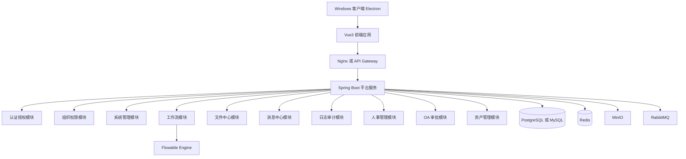
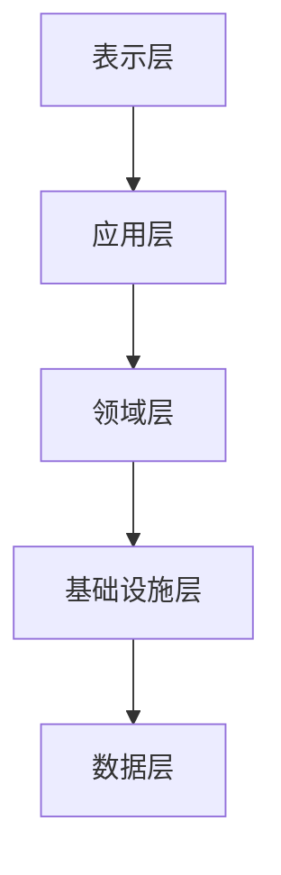
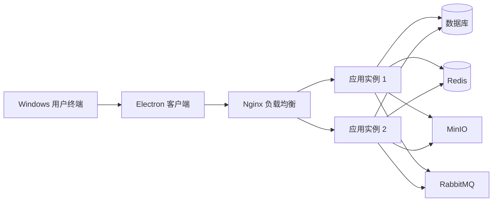

# 架构设计说明书

| 项目 | 内容 |
| --- | --- |
| 项目名称 | Open Management |
| 文档编号 | OM-DES-ARCH-001 |
| 文档版本 | V1.0 |
| 文档状态 | 评审版 |
| 密级 | 内部 |
| 编制日期 | 2026-04-20 |
| 适用阶段 | 设计评审、开发基线输入 |
| 责任角色 | 架构师、技术负责人 |

## 1. 修订记录

| 版本 | 日期 | 修订人 | 修订说明 |
| --- | --- | --- | --- |
| V1.0 | 2026-04-20 | Codex | 将架构草案整理为正式评审版架构设计说明书 |

## 2. 设计目标

- 支撑国有企业千级用户场景
- 满足统一权限、统一流程、统一审计要求
- 控制第一阶段复杂度，优先保证稳定性和可维护性
- 为后续模块扩展和架构演进预留边界

## 3. 设计原则与约束

### 3.1 设计原则

- 平台优先于业务模块
- 模块化单体优先于过早微服务化
- 通用能力统一收口
- 安全与审计从第一版内建
- 数据权限和组织权限统一口径

### 3.2 关键约束

- 客户端需交付为 Windows 软件
- 服务端采用集中部署
- 技术栈以成熟、可靠、招聘和维护成本可控为优先
- 后续需兼容单点登录、国产数据库和信创环境

## 4. 技术选型

### 4.1 前端

- Vue 3
- TypeScript
- Element Plus
- Pinia
- Vue Router
- ECharts

### 4.2 Windows 客户端

- Electron
- electron-builder

### 4.3 后端

- Java 17
- Spring Boot
- Spring Security 或 Sa-Token
- MyBatis-Plus
- Flowable
- Redis
- RabbitMQ
- MinIO

### 4.4 数据库

- PostgreSQL
- MySQL 8

## 5. 总体架构

总体说明：

- Electron 负责 Windows 客户端交付形态和桌面封装
- Vue 负责统一前端呈现
- Spring Boot 作为第一阶段业务承载核心
- 通用能力平台化，业务能力模块化

## 6. 分层架构

分层职责：

- 表示层：页面、路由、控制器、DTO
- 应用层：流程编排、接口服务、权限协调
- 领域层：业务规则、聚合、状态流转
- 基础设施层：ORM、缓存、消息、文件存储、流程适配
- 数据层：数据库、对象存储、缓存

## 7. 部署架构

部署建议：

- 应用层至少双实例部署
- 数据库采用主从或高可用架构
- Redis、MinIO、RabbitMQ 独立部署
- Nginx 承担反向代理和负载均衡职责

## 8. 模块划分

| 模块 | 说明 |
| --- | --- |
| `auth` | 认证授权 |
| `system` | 系统管理 |
| `org` | 组织架构 |
| `workflow` | 工作流 |
| `file` | 文件中心 |
| `message` | 消息中心 |
| `audit` | 日志审计 |
| `hr` | 人事管理 |
| `oa` | OA 审批 |
| `asset` | 资产管理 |
| `report` | 报表中心 |

## 9. 安全架构要求

- 所有接口统一鉴权
- 菜单、按钮、数据权限三层控制
- 密码采用强哈希存储
- 登录行为、操作行为、审批行为全量留痕
- 文件上传执行白名单校验

## 10. 演进路线

### 10.1 阶段一

- 平台底座
- 人员信息管理
- OA 审批
- 资产管理

### 10.2 阶段二

- 合同管理
- 采购管理
- 档案管理
- 报表中心增强

### 10.3 阶段三

- 按负载与边界拆分服务
- 增加更细粒度监控与运维平台

## 11. 架构风险与控制

| 风险 | 说明 | 控制措施 |
| --- | --- | --- |
| 过早微服务化 | 第一阶段复杂度失控 | 先采用模块化单体 |
| 权限模型返工 | 数据权限设计不完整 | 第一阶段固化权限模型 |
| 工作流耦合过深 | 业务流程难以演进 | 工作流统一通过平台能力接入 |
| 客户端升级复杂 | Windows 客户端后期维护成本高 | 采用 Electron 标准化封装和更新机制 |
