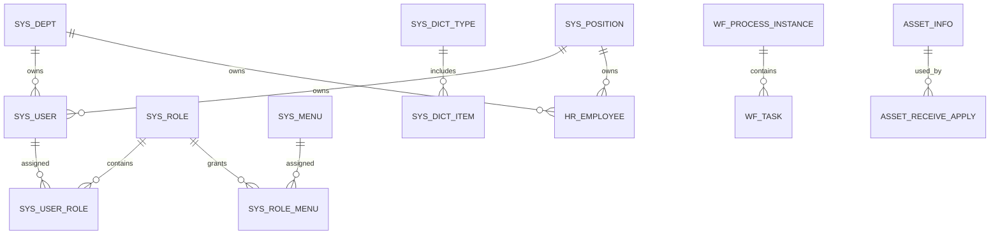

# 数据库设计说明书

| 项目 | 内容 |
| --- | --- |
| 项目名称 | Open Management |
| 文档编号 | OM-DES-DB-001 |
| 文档版本 | V1.0 |
| 文档状态 | 评审版 |
| 密级 | 内部 |
| 编制日期 | 2026-04-20 |
| 适用阶段 | 设计评审、数据库建模、DDL 编写 |
| 责任角色 | 架构师、后端负责人、DBA |

## 1. 修订记录

| 版本 | 日期 | 修订人 | 修订说明 |
| --- | --- | --- | --- |
| V1.0 | 2026-04-20 | Codex | 将数据库草案整理为正式评审版数据库设计说明书 |

## 2. 文档目的

本文档用于明确系统核心数据域、实体关系、表设计原则和数据库实施边界，作为后续 DDL 脚本、ORM 映射、索引设计和数据迁移策略的输入基线。

## 3. 设计原则

- 统一主键策略，优先使用 `bigint`
- 公共审计字段统一，包括创建人、创建时间、更新人、更新时间、逻辑删除标记
- 状态字段统一通过字典项进行约束
- 业务表默认采用逻辑删除
- 设计阶段明确外键关系，实现阶段按性能与运维策略决定物理约束
- 避免深度依赖数据库方言，降低后续迁移成本

## 4. 主题域划分

| 主题域 | 核心表 |
| --- | --- |
| 平台底座 | `sys_user`、`sys_role`、`sys_dept`、`sys_menu`、`sys_dict_type`、`sys_config` |
| 流程域 | `wf_process_definition`、`wf_process_instance`、`wf_task` |
| 人事域 | `hr_employee`、`hr_employee_change` |
| OA 域 | `oa_leave_apply`、`oa_travel_apply`、`oa_expense_apply` |
| 资产域 | `asset_info`、`asset_receive_apply`、`asset_return_record`、`asset_repair_apply`、`asset_scrap_apply` |

## 5. 核心实体关系图

## 6. 核心表清单

### 6.1 平台底座

- `sys_user`
- `sys_role`
- `sys_user_role`
- `sys_dept`
- `sys_position`
- `sys_menu`
- `sys_role_menu`
- `sys_dict_type`
- `sys_dict_item`
- `sys_config`
- `sys_file`
- `sys_message`
- `sys_login_log`
- `sys_operate_log`
- `sys_exception_log`

### 6.2 工作流

- `wf_process_definition`
- `wf_process_instance`
- `wf_task`

### 6.3 人事

- `hr_employee`
- `hr_employee_change`

### 6.4 OA

- `oa_leave_apply`
- `oa_travel_apply`
- `oa_expense_apply`

### 6.5 资产

- `asset_info`
- `asset_receive_apply`
- `asset_return_record`
- `asset_repair_apply`
- `asset_scrap_apply`

## 7. 核心表说明

### 7.1 `sys_user`

| 字段 | 类型 | 说明 |
| --- | --- | --- |
| id | bigint | 主键 |
| username | varchar(50) | 登录账号或工号 |
| password_hash | varchar(255) | 密码哈希 |
| real_name | varchar(50) | 姓名 |
| mobile | varchar(20) | 手机号 |
| email | varchar(100) | 邮箱 |
| dept_id | bigint | 部门 ID |
| position_id | bigint | 岗位 ID |
| status | varchar(20) | 状态 |
| last_login_time | datetime | 最近登录时间 |

索引建议：

- `uk_sys_user_username`
- `idx_sys_user_dept_id`
- `idx_sys_user_status`

### 7.2 `sys_dept`

| 字段 | 类型 | 说明 |
| --- | --- | --- |
| id | bigint | 主键 |
| dept_code | varchar(50) | 部门编码 |
| dept_name | varchar(100) | 部门名称 |
| parent_id | bigint | 上级部门 ID |
| dept_type | varchar(20) | 部门类型 |
| leader_user_id | bigint | 负责人 |
| status | varchar(20) | 状态 |

### 7.3 `sys_role`

| 字段 | 类型 | 说明 |
| --- | --- | --- |
| id | bigint | 主键 |
| role_code | varchar(50) | 角色编码 |
| role_name | varchar(100) | 角色名称 |
| data_scope | varchar(20) | 数据权限范围 |
| status | varchar(20) | 状态 |

### 7.4 `sys_menu`

| 字段 | 类型 | 说明 |
| --- | --- | --- |
| id | bigint | 主键 |
| parent_id | bigint | 父菜单 ID |
| menu_name | varchar(100) | 菜单名称 |
| menu_type | varchar(20) | 目录、菜单、按钮 |
| path | varchar(200) | 路由路径 |
| component | varchar(200) | 前端组件路径 |
| permission_code | varchar(100) | 权限标识 |

### 7.5 `wf_process_instance`

| 字段 | 类型 | 说明 |
| --- | --- | --- |
| id | bigint | 主键 |
| process_key | varchar(100) | 流程定义编码 |
| business_key | varchar(100) | 业务键 |
| business_type | varchar(50) | 业务类型 |
| starter_id | bigint | 发起人 |
| start_time | datetime | 发起时间 |
| end_time | datetime | 结束时间 |
| status | varchar(20) | 状态 |

### 7.6 `hr_employee`

| 字段 | 类型 | 说明 |
| --- | --- | --- |
| id | bigint | 主键 |
| emp_no | varchar(50) | 员工编号 |
| emp_name | varchar(50) | 姓名 |
| id_no | varchar(18) | 身份证号 |
| dept_id | bigint | 部门 |
| position_id | bigint | 岗位 |
| hire_date | date | 入职日期 |
| emp_status | varchar(20) | 员工状态 |

### 7.7 `oa_leave_apply`

| 字段 | 类型 | 说明 |
| --- | --- | --- |
| id | bigint | 主键 |
| apply_no | varchar(50) | 申请单号 |
| applicant_id | bigint | 申请人 |
| leave_type | varchar(20) | 请假类型 |
| start_time | datetime | 开始时间 |
| end_time | datetime | 结束时间 |
| leave_days | decimal(6,2) | 请假天数 |
| process_instance_id | bigint | 流程实例 ID |
| apply_status | varchar(20) | 状态 |

### 7.8 `asset_info`

| 字段 | 类型 | 说明 |
| --- | --- | --- |
| id | bigint | 主键 |
| asset_code | varchar(50) | 资产编号 |
| asset_name | varchar(100) | 资产名称 |
| category | varchar(50) | 资产类别 |
| asset_status | varchar(20) | 资产状态 |
| location | varchar(200) | 存放地点 |

## 8. 公共字段规范

建议所有业务表统一包含以下字段：

| 字段 | 说明 |
| --- | --- |
| created_by | 创建人 |
| created_at | 创建时间 |
| updated_by | 更新人 |
| updated_at | 更新时间 |
| deleted_flag | 逻辑删除标记 |
| version_no | 乐观锁版本号 |

## 9. 索引与约束原则

- 唯一业务编码必须建立唯一索引
- 高频查询条件应建立普通索引
- 联合索引按查询最左前缀原则设计
- 状态、部门、业务单号等高频过滤字段优先考虑索引

## 10. 数据安全与归档要求

- 敏感字段按业务需要脱敏展示
- 审计和日志数据保留周期需单独制定
- 文件和数据库备份周期需一致纳管
- 历史流程和日志数据需预留归档策略

## 11. 初始字典建议

- `USER_STATUS`
- `DEPT_TYPE`
- `ROLE_DATA_SCOPE`
- `LEAVE_TYPE`
- `EMP_STATUS`
- `ASSET_STATUS`
- `MSG_TYPE`
- `WORKFLOW_STATUS`
- `APPLY_STATUS`

## 12. 数据库选型建议

- 优先 PostgreSQL，用于更严谨的企业级事务和复杂查询能力
- 如团队已有成熟经验，也可先使用 MySQL 8
- 生产实现需避免强依赖数据库专有语法
