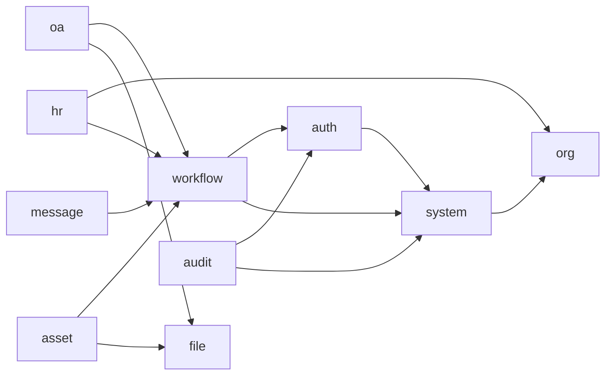

# 模块设计说明书

| 项目 | 内容 |
| --- | --- |
| 项目名称 | Open Management |
| 文档编号 | OM-DES-MOD-001 |
| 文档版本 | V1.0 |
| 文档状态 | 评审版 |
| 密级 | 内部 |
| 编制日期 | 2026-04-20 |
| 适用阶段 | 设计评审、详细设计、开发实施 |
| 责任角色 | 架构师、后端负责人、前端负责人 |

## 1. 修订记录

| 版本 | 日期 | 修订人 | 修订说明 |
| --- | --- | --- | --- |
| V1.0 | 2026-04-20 | Codex | 将模块划分草案整理为正式评审版模块设计说明书 |

## 2. 文档目的

本文档用于明确模块边界、职责分工、依赖关系、共性能力接入方式和关键状态流转，是工程目录规划和详细设计拆分的依据。

## 3. 模块划分

| 模块 | 说明 |
| --- | --- |
| `auth` | 认证授权 |
| `system` | 系统管理 |
| `org` | 组织架构 |
| `workflow` | 工作流 |
| `file` | 文件中心 |
| `message` | 消息中心 |
| `audit` | 日志审计 |
| `hr` | 人事管理 |
| `oa` | OA 审批 |
| `asset` | 资产管理 |
| `report` | 报表中心 |

## 4. 模块依赖关系



## 5. 共性能力分配原则

| 能力 | 归属模块 | 说明 |
| --- | --- | --- |
| 登录认证 | `auth` | 账号认证、密码策略、Token 管理 |
| 权限控制 | `auth` + `system` + `org` | 菜单、按钮、数据权限统一治理 |
| 组织模型 | `org` | 部门、岗位、汇报关系 |
| 工作流能力 | `workflow` | 流程定义、任务处理、状态回写 |
| 文件能力 | `file` | 上传、下载、预览、业务绑定 |
| 消息能力 | `message` | 待办、通知、结果消息 |
| 审计能力 | `audit` | 登录、操作、异常、审批留痕 |

## 6. 各模块设计

### 6.1 `auth`

职责：

- 登录、退出
- Token 管理
- 密码策略
- 验证码
- 登录失败锁定

建议核心类：

- `AuthController`
- `LoginService`
- `TokenService`
- `CaptchaService`
- `PasswordPolicyService`

### 6.2 `system`

职责：

- 用户管理
- 角色管理
- 菜单管理
- 字典管理
- 参数配置

建议核心类：

- `UserController`
- `RoleController`
- `MenuController`
- `DictController`
- `ConfigController`

### 6.3 `org`

职责：

- 部门树维护
- 岗位维护
- 用户归属组织
- 组织级数据权限支持

建议核心类：

- `DeptController`
- `PositionController`
- `OrgTreeService`

### 6.4 `workflow`

职责：

- 流程定义发布
- 表单绑定
- 发起审批
- 审批处理
- 流程跟踪

建议核心类：

- `WorkflowController`
- `ProcessDefinitionService`
- `ProcessInstanceService`
- `TaskService`
- `WorkflowFormBinder`

### 6.5 `file`

职责：

- 文件上传
- 文件存储
- 文件预览
- 附件业务绑定
- 下载权限校验

建议核心类：

- `FileController`
- `FileStorageService`
- `FileBizRelationService`

### 6.6 `message`

职责：

- 消息生成
- 已读未读管理
- 消息查询
- 审批事件推送

建议核心类：

- `MessageController`
- `MessageService`
- `TodoGenerateService`

### 6.7 `audit`

职责：

- 登录日志
- 操作日志
- 异常日志
- 导出日志
- 审批日志

建议核心类：

- `LoginLogService`
- `OperateLogService`
- `ExceptionLogService`
- `AuditQueryController`

### 6.8 `hr`

职责：

- 员工档案
- 入转调离
- 岗位和部门关联
- 员工查询统计

建议核心类：

- `EmployeeController`
- `EmployeeService`
- `EmployeeChangeService`

### 6.9 `oa`

职责：

- 请假
- 出差
- 报销
- 与工作流集成
- 审批结果回写

建议核心类：

- `LeaveApplyController`
- `TravelApplyController`
- `ExpenseApplyController`

### 6.10 `asset`

职责：

- 资产台账
- 领用
- 归还
- 维修
- 报废

建议核心类：

- `AssetController`
- `AssetReceiveController`
- `AssetRepairController`
- `AssetScrapController`

## 7. 工程分层建议

建议单模块内统一采用以下分层：

- `controller`
- `service`
- `service.impl`
- `domain/entity`
- `mapper`
- `dto`
- `vo`
- `convert`
- `enums`

规则：

- Controller 不承载复杂业务逻辑
- Service 承担业务规则和事务控制
- Mapper 只负责数据访问
- DTO 和 VO 不混用

## 8. 关键状态流转

### 8.1 用户状态

- `ENABLED`
- `DISABLED`
- `LOCKED`

### 8.2 请假单状态

```text
DRAFT -> SUBMITTED -> APPROVING -> APPROVED
                     |
                     -> REJECTED
DRAFT/SUBMITTED -> CANCELLED
```

### 8.3 资产领用状态

```text
DRAFT -> SUBMITTED -> APPROVING -> APPROVED -> RETURNED
                     |
                     -> REJECTED
```

### 8.4 资产报废状态

```text
DRAFT -> SUBMITTED -> APPROVING -> APPROVED -> SCRAPPED
                     |
                     -> REJECTED
```

## 9. 扩展设计要求

- 新增业务模块必须复用权限、流程、文件、消息、审计能力
- 新增业务状态不得绕开统一状态枚举和字典体系
- 新增模块如引入跨模块耦合，应优先通过应用层服务协调
