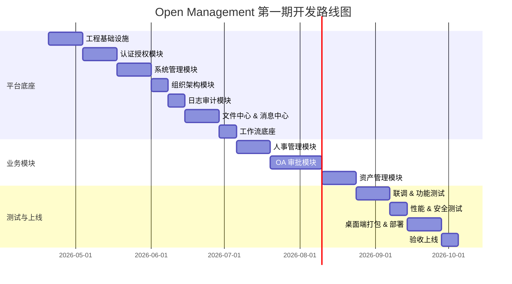

# 开发路线图

| 项目 | 内容 |
| --- | --- |
| 项目名称 | Open Management |
| 文档编号 | OM-PLN-RMP-001 |
| 文档版本 | V1.0 |
| 文档状态 | 评审版 |
| 密级 | 内部 |
| 编制日期 | 2026-04-20 |
| 适用阶段 | 立项、实施管理、阶段验收、后续规划 |
| 责任角色 | 项目经理、产品经理、架构师、技术负责人 |

## 1. 修订记录

| 版本 | 日期 | 修订人 | 修订说明 |
| --- | --- | --- | --- |
| V1.0 | 2026-04-20 | Codex | 基于实施计划、架构设计和代码框架现状，编制正式评审版开发路线图 |

## 2. 路线图目标

本路线图描述 Open Management 从当前代码脚手架阶段到正式上线，以及后续扩展迭代的完整开发路径，覆盖以下维度：

- 阶段划分与里程碑目标
- 各阶段功能交付范围
- 后端、前端、桌面端、数据库的同步推进节奏
- 第二期及未来演进方向

## 3. 当前基线状态

| 层次 | 现状 |
| --- | --- |
| 后端 | 12 个 Maven 子模块已建立（om-common / om-auth / om-system / om-org / om-workflow / om-file / om-message / om-audit / om-hr / om-oa / om-asset / om-app），核心骨架类已就位 |
| 前端 | Vue3 + TypeScript 框架已就位，api 层（auth / system / org / hr / oa / asset）、views 层、router 层骨架已创建 |
| 桌面端 | Electron + electron-builder 项目骨架已就位 |
| 数据库 | V1.0.0–V1.0.5 共 6 个 Flyway 迁移脚本已占位 |
| 文档 | 完整 V1.0 评审版文档包（9 篇文档）已就绪 |

---

## 4. 第一期路线图：平台上线（第 8–24 周）

### 4.1 总览

### 4.2 阶段一：平台底座（第 8–13 周）

#### Sprint 1：工程基础设施（第 8–9 周）

**交付目标：** 整个工程可以本地启动运行，数据库初始化完整。

| 层次 | 交付内容 |
| --- | --- |
| 后端 | `om-app` 完善 Spring Boot 主配置（数据源、Redis、MinIO、RabbitMQ、Sa-Token、Flyway）；`om-common` 补全常量、枚举、工具类、统一分页查询、全局异常体系；配置 `application.yml` 分环境配置（dev / prod） |
| 数据库 | 落地 `V1.0.0__platform_ddl.sql`（sys_user、sys_role、sys_menu、sys_dept、sys_post、sys_dict_type、sys_dict_data、sys_config 等表 DDL）；落地 `V1.0.5__init_data.sql`（初始菜单、角色、超级管理员账号、字典数据） |
| 前端 | 完善 `request.ts`（拦截器、统一错误处理、Token 刷新）；完善路由守卫（登录态检查、权限拦截）；建立全局 Layout（侧边菜单、顶部导航、面包屑）；建立公共组件库（分页表格、搜索表单、确认弹窗、文件上传） |

#### Sprint 2：认证授权模块（第 9–10 周）

**交付目标：** 账号登录、菜单权限、按钮权限、数据权限全部可用。

| 层次 | 交付内容 |
| --- | --- |
| 后端 `om-auth` | `LoginService`（验证码生成与校验、账号密码登录、失败计数与锁定）；`TokenService`（Sa-Token 集成、Token 生成/刷新/失效）；`PasswordPolicyService`；`AuthController`（/login、/logout、/captcha、/refresh-token） |
| 后端权限层 | `om-system` 菜单权限树查询（基于角色动态返回菜单列表）；按钮权限标识接口；数据权限注解和拦截器（SELF / DEPT / DEPT_AND_CHILD / ALL 四种策略） |
| 前端 | `/login` 页（账号、密码、验证码，表单校验）；登录后权限菜单动态加载（Pinia user/permission store）；无权限页面跳转至 403 页 |

#### Sprint 3：系统管理模块（第 10–11 周）

**交付目标：** 用户、角色、菜单、字典、参数的完整 CRUD 和权限分配。

| 层次 | 交付内容 |
| --- | --- |
| 后端 `om-system` | `UserController/UserService`（增删改查、启停、重置密码、角色绑定、数据权限过滤）；`RoleController/RoleService`（菜单权限分配、数据权限分配）；`MenuController/MenuService`；`DictController/DictService`；`ConfigController/ConfigService` |
| 前端 `views/system` | 用户管理页；角色管理页（菜单权限树勾选、数据权限设置）；菜单管理页；字典管理页；参数配置页 |

#### Sprint 4：组织架构模块（第 11 周）

**交付目标：** 部门树和岗位可维护，组织级数据权限可查询。

| 层次 | 交付内容 |
| --- | --- |
| 后端 `om-org` | `DeptController/DeptService`（部门树 CRUD、启停、负责人配置）；`PositionController/PositionService`（岗位 CRUD、岗位分配）；org-tree 查询接口供权限模块调用 |
| 前端 `views/org` | 部门树管理页；岗位管理页 |

#### Sprint 5：日志审计模块（第 12 周）

**交付目标：** 登录、操作、异常日志全量留痕，可查询导出。

| 层次 | 交付内容 |
| --- | --- |
| 后端 `om-audit` | 登录日志记录（在 auth 模块登录/失败时写入）；操作日志 AOP 注解（`@OperateLog` 切面）；异常日志记录；导出行为日志记录；`AuditQueryController`（分页查询登录日志、操作日志、导出） |
| 前端 | 登录日志列表页；操作日志列表页 |

#### Sprint 6：文件中心与消息中心（第 12–13 周）

**交付目标：** 附件上传下载预览可用，消息待办推送可用。

| 层次 | 交付内容 |
| --- | --- |
| 后端 `om-file` | MinIO 集成；`FileController/FileStorageService`（上传/下载/预览）；文件类型白名单与大小限制；`FileBizRelationService`（业务单据绑定附件）；下载权限校验 |
| 后端 `om-message` | `MessageService`（消息记录、已读/未读管理）；`TodoGenerateService`（审批流转时自动生成待办）；`MessageController`（消息列表、标记已读、跳转业务单据）；RabbitMQ 异步推送 |
| 前端 | 顶部消息中心入口（待办数量角标）；消息下拉列表；首页工作台（待办统计、快捷入口、ECharts 统计图） |

#### Sprint 7：工作流底座（第 13 周）

**交付目标：** 流程定义可发布，审批全链路（提交/审批/退回/撤回/转办/加签）可运行。

| 层次 | 交付内容 |
| --- | --- |
| 后端 `om-workflow` | Flowable 集成配置；`ProcessDefinitionService`（流程定义 CRUD、发布/挂起）；`ProcessInstanceService`（发起/查询实例）；`TaskService`（待办查询、审批/退回/撤回/转办/加签）；`WorkflowFormBinder`（业务表单与流程实例绑定）；落地 `V1.0.1__workflow_ddl.sql` |
| 前端 | 我的待办页；流程详情页（审批意见、流程图节点高亮）；流程管理页 |

**里程碑 M4 — 平台底座完成**

---

### 4.3 阶段二：业务模块（第 14–18 周）

#### Sprint 8：人事管理模块（第 14–15 周）

**交付目标：** 员工档案完整 CRUD，入转调离记录可用。

| 层次 | 交付内容 |
| --- | --- |
| 后端 `om-hr` | `EmployeeController/EmployeeService`（员工档案增删改查、格式校验、状态管理）；`EmployeeChangeService`（入转调离记录）；档案与附件绑定（调用 om-file）；员工统计接口；落地 `V1.0.2__hr_ddl.sql` |
| 前端 `views/hr` | 员工档案列表页（搜索、分页、批量操作）；员工档案详情/编辑页（字段分组、附件上传、状态流转）；入转调离记录页 |

#### Sprint 9：OA 审批模块（第 15–17 周）

**交付目标：** 请假、出差、报销三类审批全链路可用。

| 层次 | 交付内容 |
| --- | --- |
| 后端 `om-oa` | `LeaveApplyController/Service`（请假申请 CRUD、工作流集成、状态机）；`TravelApplyController/Service`（出差申请 CRUD）；`ExpenseApplyController/Service`（报销申请 CRUD、审批结果回写）；审批单触发待办消息生成；落地 `V1.0.3__oa_ddl.sql` |
| 前端 `views/oa` | 请假申请页（表单、类型选择、时间校验、附件上传）；出差申请页；报销申请页；我的申请列表（状态筛选、进度查看）；待办审批处理页（审批意见、流程图） |

#### Sprint 10：资产管理模块（第 17–18 周）

**交付目标：** 资产台账和领用、归还、维修、报废全流程可用。

| 层次 | 交付内容 |
| --- | --- |
| 后端 `om-asset` | `AssetController/AssetService`（资产台账 CRUD、状态管理：IDLE / IN_USE / REPAIR / SCRAPPED）；`AssetReceiveController/Service`（领用申请、审批、状态回写）；归还、维修、报废 Controller/Service；资产状态互斥校验；落地 `V1.0.4__asset_ddl.sql` |
| 前端 `views/asset` | 资产台账列表页（搜索、状态筛选、新增/编辑）；领用申请页；归还/维修/报废申请页；资产管理员处理页 |

**里程碑 M5 — 业务模块完成**

---

### 4.4 阶段三：联调测试（第 19–21 周）

#### Sprint 11：功能测试与缺陷修复（第 19–20 周）

- 后端 Service 层单元测试（目标覆盖率 ≥ 60%）
- 前后端联调（修复接口不一致、权限漏洞、状态机 Bug）
- 全局错误处理完善（前端统一 Toast、后端统一错误码体系）
- 数据权限功能测试（各角色隔离验证）
- 工作流全链路测试（发起 → 审批 → 退回 → 撤回 → 转办）

#### Sprint 12：性能与安全测试（第 20–21 周）

- JMeter 压力测试（登录、列表查询、工作流提交，目标：千级并发场景）
- SQL 执行计划审查（慢查询优化、索引补全）
- 安全测试（SQL 注入、XSS、越权访问、文件上传漏洞、Session 管理）
- 密码强哈希（BCrypt）、验证码、登录锁定机制验证

**里程碑 M6 — 测试通过**

---

### 4.5 阶段四：试运行与上线（第 22–24 周）

#### Sprint 13：桌面端打包与部署（第 22–23 周）

| 层次 | 交付内容 |
| --- | --- |
| 桌面端 `desktop` | Electron 主进程配置（窗口管理、深链跳转、系统托盘）；`electron-builder.yml` 完善（Windows NSIS 安装包）；electron-updater 自动更新机制；前端构建物集成到 Electron |
| 部署 | Docker Compose（应用 + PostgreSQL/MySQL + Redis + MinIO + RabbitMQ）；Nginx 配置（反向代理、静态资源、HTTPS）；部署手册和运维手册；生产环境双实例部署验证 |

#### Sprint 14：验收上线（第 24 周）

- 用户培训文档和操作手册
- 生产数据初始化（组织架构、角色权限、字典数据）
- 正式验收测试
- 上线切换与监控确认

**里程碑 M7 — 正式上线**

---

## 5. 第二期路线图：能力扩展

第二期在第一期平台底座稳定运行后启动，具体排期视第一期上线时间和业务优先级确定。

| 模块 | 主要功能 | 优先级 |
| --- | --- | --- |
| 合同管理 | 合同台账、审批、到期预警、关联采购 | P1 |
| 采购管理 | 采购申请、供应商管理、入库登记 | P1 |
| 档案管理 | 电子档案、分类归档、档案检索 | P2 |
| 报表中心增强 | 可配置报表模板、多维统计、定时导出 | P1 |
| 国产数据库适配 | 达梦、人大金仓适配层 | P2 |
| 信创环境适配 | 国密算法（SM2/SM4）、统信 OS 支持 | P2 |

---

## 6. 第三期路线图：架构演进

第三期为长期演进方向，在平台用户规模和业务复杂度达到触发条件后启动。

| 演进项 | 说明 |
| --- | --- |
| 按负载边界拆分微服务 | 将 auth、workflow、file 等高并发模块按需拆分为独立服务 |
| 监控与可观测性平台 | 接入 Prometheus + Grafana，建立链路追踪（OpenTelemetry） |
| 移动端 App | 审批待办、个人信息查询的移动端入口 |
| 多租户支持 | 集团多子公司独立数据隔离方案 |
| 低代码配置 | 表单、流程、报表可视化配置能力 |

---

## 7. 里程碑汇总

| 里程碑 | 目标 | 对应阶段 |
| --- | --- | --- |
| M1 项目立项通过 | 项目章程、实施计划、需求范围确认 | 第 1–2 周 |
| M2 需求评审通过 | 用户故事、FSD、SRS 完成 | 第 3–5 周 |
| M3 设计评审通过 | 架构、数据库、接口、模块设计完成 | 第 6–7 周 |
| M4 平台底座完成 | 认证、权限、组织、日志、文件、消息、工作流可用 | 第 13 周 |
| M5 业务模块完成 | 人事、OA、资产三个业务模块可用 | 第 18 周 |
| M6 测试通过 | 功能、性能、安全测试全部通过 | 第 21 周 |
| M7 正式上线 | 生产环境部署、验收、上线 | 第 24 周 |

---

## 8. 开发约束与原则

以下约束贯穿全期开发，任何阶段不得违反：

| 约束 | 说明 |
| --- | --- |
| 权限优先 | 数据权限模型在 Sprint 2 固化，所有业务模块必须复用，严禁绕开 |
| 流程统一 | OA / HR / Asset 所有审批必须走 Flowable 引擎，不允许自研审批链 |
| 审计内建 | 所有增删改操作、登录行为、文件下载必须在模块内部完成留痕 |
| 接口规范 | 严格遵循接口设计说明书定义的统一错误模型和鉴权方式 |
| 平台优先于业务 | 新增业务模块必须复用权限、流程、文件、消息、审计能力，不得自建平行通道 |
| 文档基线同步 | 任何需求或接口变更，必须先更新对应文档并升级版本号，再进入开发 |
